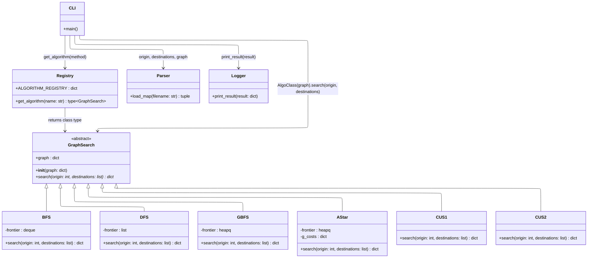

# Architecture — Class Diagram

## Key Design Decisions

| Decision | Rationale |
|---|---|
| `GraphSearch` is abstract | Enforces uniform `search()` interface across all algorithms via Python `ABC` |
| `graph` stored in `__init__` | Stable state — defines what the object operates on |
| `origin` & `destinations` as `search()` params | Transient query inputs — allows object reuse across multiple searches |
| `Registry` returns class type, not instance | CLI controls instantiation; separates name resolution from object creation (DI pattern) |
| `Parser` is a standalone service | Keeps file I/O concerns out of `GraphSearch` (Single Responsibility Principle) |
| `Logger` is a standalone service | Decouples output formatting from algorithm logic; easy to swap for GUI renderer later |
